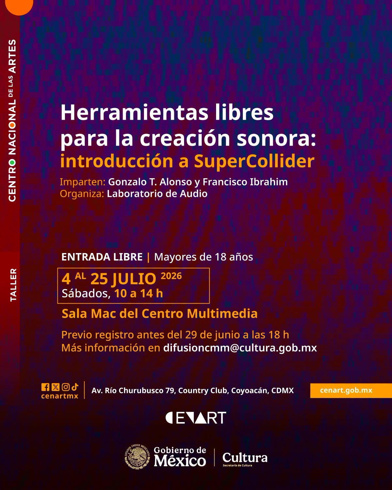

# Herramientas libres para la creación sonora: introducción a SuperCollider

# TEMARIO  

## Día 1
#### Conceptos básicos de SuperCollider
* Descripción, breve historia, arquitectura, y acciones básicas.
* Programación orientada a objetos: clases, métodos y argumentos.

#### Audio digital básico
* Sonido
* Frecuencia 
* Amplitud
* Fase 
* Frecuencia de muestreo 
* Profundidad de bits

#### Descanso

#### UGens y funciones
* UGens
* UGens básicos de producción de sonido
* Funciones
* Argumentos y variables

#### Eventos en el tiempo
* Relojes
* Rutinas
* Loop

#### Ejercicios prácticos
* Ejercicio de composición colectiva / “En Do” u otra canción simple / Ejercicios en equipos e improvisación.
* Ejercicios individuales de composición.

## Día 2
#### SynthDef
* Concepto de SynthDef
* Envolventes
* Arrays y expansión multicanal
* Paneos
* Nodos y done action
* Aleatoriedad

#### Control de eventos en el tiempo
* Patrones
* Eventos
* Reproducción de eventos

#### Grabación
* s.record

#### Ejercicios prácticos
* SynthDef colaborativo
* Ejercicios individuales de Pbind e improvisación colectiva

## Día 3
#### SynthDef para reproducción de audio
* Buffers y manejo de archivos de audio
* Reproducción de archivos de audio

#### Procesamiento de audio
* SoundIn
* Buses
* Filtros
* Efectos

#### Control de eventos sincronizados en el tiempo
* Ppar y sincronización de reproductores de eventos
* Quant
* Pdef y/o Pmono

#### Ejercicios prácticos
* Pequeña pieza individual o en conjunto

## Día 4
#### Técnicas de síntesis
* Síntesis aditiva
* Síntesis sustractiva
* Síntesis AM
* Síntesis FM

#### Herramientas para un código más limpio
* Iteración y lógica condicional

#### Interacción y conectividad
* Control por MIDI
* Control por OSC

#### Ejercicios prácticos
* Ejercicio libre en conjunto: lluvia de ideas.
* Ejercicio libre individual con lo visto en el curso.